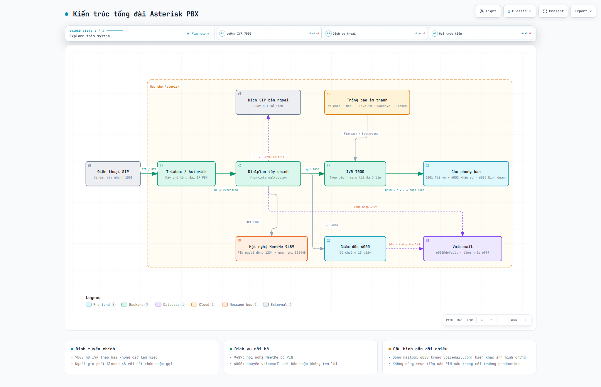
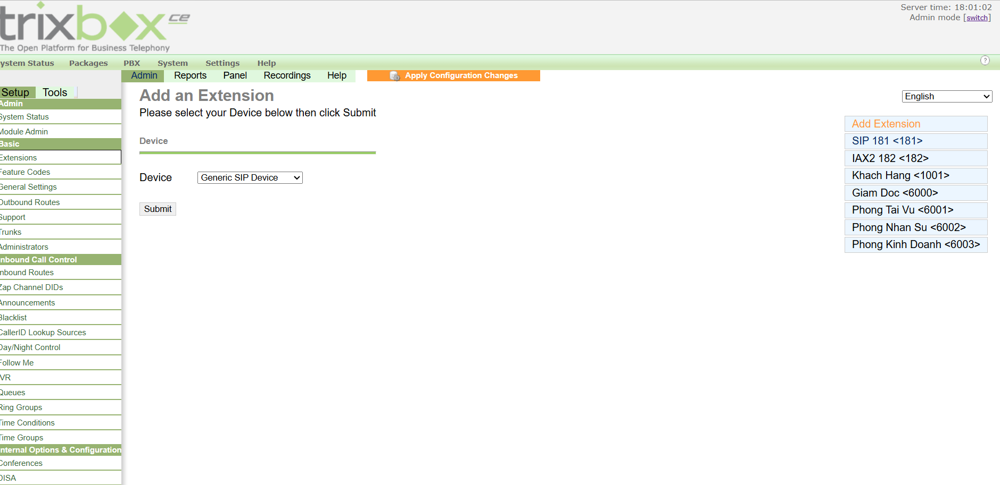
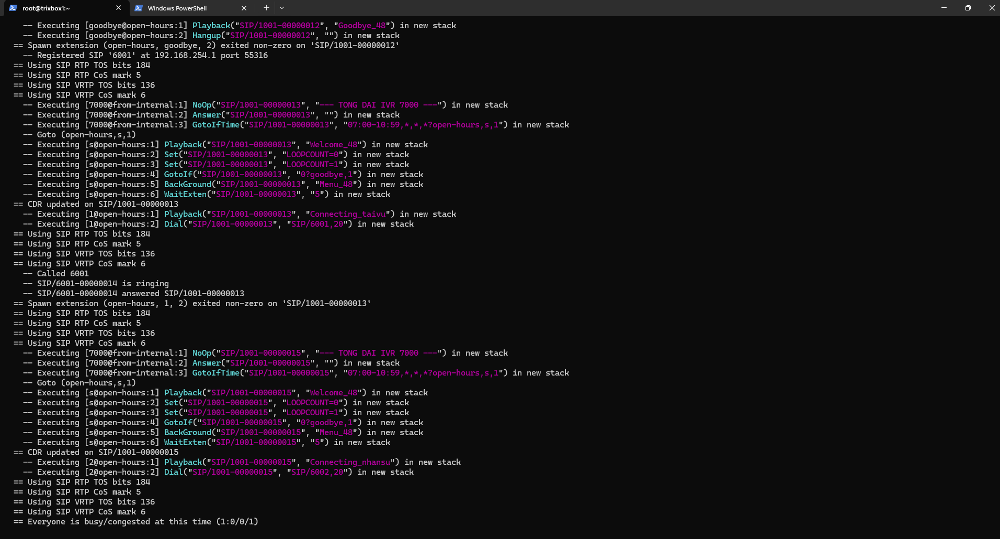
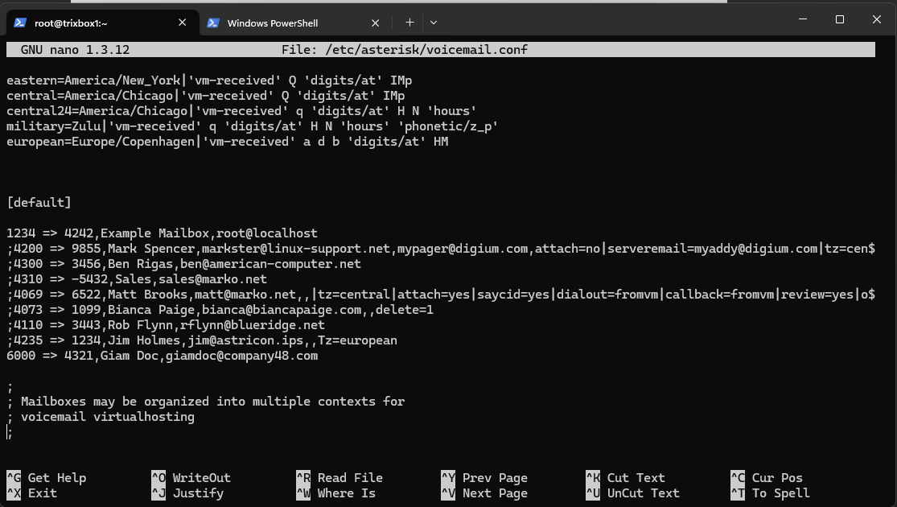
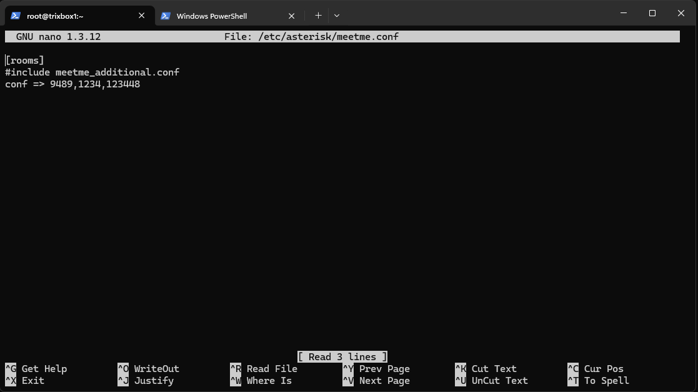

# Hệ thống tổng đài Asterisk PBX: IVR, Voicemail và Conference

Mô hình tổng đài IP PBX xây dựng trên **Trixbox CE / Asterisk**, minh họa cách định tuyến cuộc gọi SIP, xây dựng IVR theo khung giờ, chuyển cuộc gọi đến các phòng ban, lưu voicemail và tổ chức phòng hội nghị MeetMe.

Repository bao gồm dialplan tùy chỉnh, cấu hình voicemail/MeetMe, bộ lời chào tiếng Việt và ảnh chụp kết quả kiểm thử thực tế.

> [!IMPORTANT]
> Đây là cấu hình phục vụ học tập/lab trên phiên bản Asterisk cũ sử dụng `chan_sip` và `MeetMe`. Hãy đọc mục [Cần sửa trước khi chạy](#cần-sửa-trước-khi-chạy) trước khi sao chép cấu hình lên máy chủ.

## Tính năng

- Gọi trực tiếp các máy nhánh SIP theo mẫu `6XXX`.
- Gọi ra một đích SIP bằng tiền tố `8` và tự động loại bỏ tiền tố trước khi quay số.
- IVR tại số `7000`, tự động phân luồng trong và ngoài giờ làm việc.
- Menu phím bấm chuyển đến Tài vụ, Nhân sự hoặc Kinh doanh.
- Cho phép nhập trực tiếp máy nhánh `6XXX` ngay trong IVR.
- Phát thông báo lỗi và lặp menu tối đa 3 lần khi nhập sai hoặc hết thời gian chờ.
- Chuyển cuộc gọi không được trả lời hoặc đang bận của Giám đốc `6000` sang voicemail.
- Truy cập hộp thư thoại qua số `6999`.
- Phòng hội nghị MeetMe `9489` với PIN người dùng và PIN quản trị.
- Kèm các file âm thanh WAV và ảnh minh chứng cho từng kịch bản chính.

## Kiến trúc

[Mở sơ đồ kiến trúc tương tác](docs/architecture.html) · [Xem đặc tả Archify JSON](docs/architecture.json)



Sơ đồ được tạo bằng Archify và thể hiện ba luồng chính:

1. Điện thoại SIP → Asterisk → dialplan → IVR → máy nhánh phòng ban.
2. Dialplan → máy Giám đốc → voicemail khi bận hoặc không trả lời.
3. Dialplan → hội nghị MeetMe hoặc đích SIP bên ngoài.

> Giao diện điều khiển cố định của file Archify dùng tiếng Anh; nội dung kiến trúc và chú thích trong sơ đồ dùng tiếng Việt.

## Danh bạ và mã dịch vụ

| Số / mẫu | Chức năng | Hành vi |
| --- | --- | --- |
| `6000` | Giám đốc | Đổ chuông 15 giây; chuyển sang `6000@default` nếu bận hoặc không trả lời |
| `6001` | Phòng Tài vụ | Nhánh `1` trong IVR |
| `6002` | Phòng Nhân sự | Nhánh `2` trong IVR |
| `6003` | Phòng Kinh doanh | Nhánh `3` trong IVR |
| `7000` | Tổng đài IVR | Phân luồng theo thời gian và phát menu tự động |
| `6999` | Voicemail | Mở `VoiceMailMain()` để đăng nhập hộp thư |
| `9489` | Conference | Vào phòng hội nghị MeetMe |
| `_6XXX` | Gọi nội bộ | Gọi trực tiếp máy nhánh SIP trong IVR |
| `_8.` | Gọi ra ngoài | Bỏ chữ số `8`, sau đó gọi `SIP/${EXTEN:1}` |

## Luồng IVR 7000

IVR được mở trong hai khung giờ:

- `07:00–10:59`
- `13:00–16:59`

Hai điều kiện `GotoIfTime` hiện áp dụng cho **mọi ngày trong tuần** vì các trường ngày/tháng/thứ đều là `*`.

Trong giờ hoạt động, hệ thống phát `Welcome_48.wav`, sau đó phát nền `Menu_48.wav` và chờ phím trong 5 giây:

| Phím | Kết quả |
| --- | --- |
| `1` | Phát `Connecting_taivu.wav`, gọi `SIP/6001` trong 20 giây |
| `2` | Phát `Connecting_nhansu.wav`, gọi `SIP/6002` trong 20 giây |
| `3` | Phát `Connecting_kinhdoanh.wav`, gọi `SIP/6003` trong 20 giây |
| `6XXX` | Gọi trực tiếp máy nhánh tương ứng trong 20 giây |
| Phím không hợp lệ | Phát `Invalid_48.wav`, sau đó quay lại menu |
| Không nhập phím | Quay lại menu |

Sau 3 lần hiển thị menu, hệ thống phát `Goodbye_48.wav` và kết thúc cuộc gọi. Ngoài giờ hoạt động, hệ thống chỉ phát `Closed_48.wav` rồi ngắt máy.

## Cấu trúc repository

```text
.
├── audio/                    # Lời chào và thông báo WAV cho IVR
├── docs/
│   ├── architecture.html     # Sơ đồ Archify tương tác
│   └── architecture.json     # Đặc tả nguồn của sơ đồ
├── proofs/                   # Ảnh cấu hình và kết quả kiểm thử
├── extensions_custom.conf    # Dialplan gọi ra, IVR, voicemail và MeetMe
├── meetme.conf               # Khai báo phòng hội nghị 9489
├── voicemail.conf            # Cấu hình app_voicemail
└── report.pdf                # Báo cáo bài lab
```

### Các file âm thanh

| File | Vai trò |
| --- | --- |
| `Welcome_48.wav` | Lời chào khi vào IVR |
| `Menu_48.wav` | Hướng dẫn lựa chọn menu |
| `Invalid_48.wav` | Thông báo phím không hợp lệ |
| `Goodbye_48.wav` | Thông báo trước khi kết thúc |
| `Closed_48.wav` | Thông báo ngoài giờ làm việc |
| `Connecting_taivu.wav` | Thông báo chuyển đến Tài vụ |
| `Connecting_nhansu.wav` | Thông báo chuyển đến Nhân sự |
| `Connecting_kinhdoanh.wav` | Thông báo chuyển đến Kinh doanh |

## Yêu cầu môi trường

- Trixbox CE / FreePBX có Asterisk hỗ trợ `chan_sip`.
- Các ứng dụng Asterisk `Dial`, `VoiceMail`, `VoiceMailMain` và `MeetMe`.
- Nguồn timing phù hợp cho MeetMe trên hệ thống Asterisk đang sử dụng.
- Các máy nhánh SIP `6000`, `6001`, `6002`, `6003` đã được tạo và đăng ký.
- Một máy nhánh thử nghiệm, ví dụ `1001`.

Repository không chứa mật khẩu SIP hoặc toàn bộ cấu hình tạo extension trong FreePBX. Các máy nhánh cần được khai báo riêng trên PBX trước khi kiểm thử dialplan.

## Cài đặt

### 1. Sao lưu cấu hình hiện tại

Thực hiện trên máy chủ Asterisk trước khi thay đổi:

```bash
cp /etc/asterisk/extensions_custom.conf /etc/asterisk/extensions_custom.conf.bak
cp /etc/asterisk/meetme.conf /etc/asterisk/meetme.conf.bak
cp /etc/asterisk/voicemail.conf /etc/asterisk/voicemail.conf.bak
```

### 2. Cài dialplan và MeetMe

Sao chép hoặc hợp nhất nội dung của các file sau:

```bash
cp extensions_custom.conf /etc/asterisk/extensions_custom.conf
cp meetme.conf /etc/asterisk/meetme.conf
```

Nếu FreePBX đang quản lý các file đích, nên **hợp nhất phần tùy chỉnh** thay vì ghi đè toàn bộ để tránh mất cấu hình sinh tự động.

### 3. Cấu hình voicemail

Không nên ghi đè nguyên file `voicemail.conf` mẫu lên hệ thống đang chạy. Hãy đối chiếu phần `[general]` và thêm mailbox `6000` vào context `[default]` sau khi sửa lỗi được nêu ở phần tiếp theo.

### 4. Cài file âm thanh

```bash
cp audio/*.wav /var/lib/asterisk/sounds/
chown asterisk:asterisk /var/lib/asterisk/sounds/*.wav
chmod 0644 /var/lib/asterisk/sounds/*.wav
```

Đường dẫn thư mục âm thanh và tài khoản dịch vụ có thể khác tùy bản phân phối Asterisk.

### 5. Nạp lại cấu hình

```bash
asterisk -rx "dialplan reload"
asterisk -rx "module reload app_voicemail.so"
asterisk -rx "module reload app_meetme.so"
```

Nếu phiên bản Asterisk không hỗ trợ reload riêng module, có thể dùng `asterisk -rx "core reload"` sau khi đã sao lưu và kiểm tra cấu hình.

## Cần sửa trước khi chạy

### Mailbox 6000 không hợp lệ

File [`voicemail.conf`](voicemail.conf) hiện có dòng:

```ini
6000 =Array
```

Dòng này không phải cú pháp khai báo mailbox hợp lệ. Ảnh minh chứng [`config_voicemail_director.png`](proofs/config_voicemail_director.png) cho thấy cấu hình dự kiến là:

```ini
6000 => 4321,Giam Doc,giamdoc@company48.com
```

Hãy thay địa chỉ email và PIN bằng giá trị phù hợp với môi trường của bạn. Không sử dụng trực tiếp các thông tin mẫu khi triển khai thật.

### Đổi toàn bộ PIN mẫu

Repository đang chứa các PIN dễ đoán phục vụ lab:

- Voicemail Giám đốc: `4321` trong ảnh minh chứng.
- MeetMe người dùng: `1234`.
- MeetMe quản trị: `123448`.

Các PIN này phải được đổi trước khi máy chủ có thể được truy cập từ mạng không tin cậy.

## Kiểm thử

Mở Asterisk CLI để theo dõi dialplan:

```bash
asterisk -rvvv
```

Kiểm tra đăng ký SIP và dialplan đã nạp:

```asterisk
sip show peers
dialplan show from-internal-custom
voicemail show users
meetme list
```

Thực hiện lần lượt các kịch bản:

1. Từ `1001`, gọi `6001` và xác nhận cuộc gọi nội bộ kết nối.
2. Gọi `81001` và xác nhận dialplan loại tiền tố `8`, sau đó gọi `1001`.
3. Gọi `7000` trong giờ hoạt động, bấm `1`, `2`, `3` và kiểm tra đúng máy nhánh đích.
4. Nhập một phím không hợp lệ hoặc chờ quá 5 giây; xác nhận menu lặp tối đa 3 lần.
5. Gọi `7000` ngoài giờ; xác nhận phát `Closed_48.wav` rồi kết thúc.
6. Gọi `6000`, không trả lời trong 15 giây; xác nhận cuộc gọi chuyển đến voicemail.
7. Gọi `6999` và đăng nhập hộp thư `6000` bằng PIN đã cấu hình.
8. Gọi `9489` bằng hai máy nhánh và xác nhận cả hai tham gia cùng phòng hội nghị.

## Minh chứng

### Danh sách máy nhánh và kết nối IVR

| Extensions trên Trixbox | IVR chuyển đến Tài vụ |
| --- | --- |
|  |  |

### Voicemail và Conference

| Voicemail Giám đốc | Phòng họp MeetMe |
| --- | --- |
|  |  |

Các ảnh kiểm thử bổ sung nằm trong thư mục [`proofs/`](proofs/), bao gồm đăng ký SIP peer, gọi nội bộ, gọi qua tiền tố `8`, xử lý phím sai, ngoài giờ, mailbox và hội nghị.

## Lưu ý triển khai

- `chan_sip` và `MeetMe` là công nghệ cũ; hệ thống Asterisk mới thường dùng `PJSIP` và `ConfBridge`.
- Không mở trực tiếp SIP, RTP hoặc giao diện quản trị PBX ra Internet nếu chưa có firewall, ACL và cơ chế chống dò mật khẩu.
- Giới hạn quyền ghi đối với file cấu hình và file âm thanh.
- Kiểm tra timezone của máy chủ vì `GotoIfTime` dùng thời gian hệ thống Asterisk.
- Luôn sao lưu cấu hình FreePBX/Trixbox trước khi chỉnh file thủ công.

## Tài liệu liên quan

- [`extensions_custom.conf`](extensions_custom.conf) — dialplan chính của project.
- [`meetme.conf`](meetme.conf) — cấu hình phòng hội nghị.
- [`voicemail.conf`](voicemail.conf) — cấu hình voicemail.
- [`report.pdf`](report.pdf) — báo cáo đầy đủ của bài lab.
